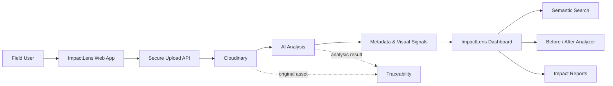

# 🌱 ImpactLens AI

> **AI-Powered Impact & Sustainability Media Intelligence Platform**

[](https://nextjs.org/)
[](https://www.typescriptlang.org/)
[](https://cloudinary.com/)
[](https://vercel.com/)

ImpactLens AI transforms field photos and videos into **searchable, traceable, AI-analyzed evidence** for NGOs, governments, sustainability teams, and impact-driven organizations.

Built for **Code Cubicle 6.0 — Cloudinary Problem Statement 02**.

---

## 🖥️ Product Screenshots

### Impact Intelligence Dashboard

<p align="center">
  
</p>

### Project & Evidence Workspace

<p align="center">
  
</p>

> The repository's UI is designed around the same visual evidence workflow shown in the dashboard and project screens: projects, media, locations, timelines, AI insights, and impact reporting.

---

## 🌍 Visual Evidence Gallery

ImpactLens is designed for real-world sustainability evidence such as renewable energy, environmental restoration, water access, infrastructure, and community programs.

<p align="center">
  
  
  
</p>

---

## ✨ Why ImpactLens?

Field teams continuously capture photos and videos, but raw media is difficult to organize, search, compare, and convert into meaningful impact evidence.

**ImpactLens creates a complete workflow:**

```
Field Media
    ↓
Cloudinary Upload
    ↓
AI Media Analysis
    ↓
Metadata & Visual Signals
    ↓
Projects / Locations / Timeline
    ↓
Semantic Discovery
    ↓
Before ↔ After Comparison
    ↓
Impact Reports & Stories
```

---

## 🚀 Core Features

### 📤 Intelligent Media Ingestion
Upload project photos and videos through a Cloudinary-backed pipeline with secure server-generated signatures.

### 🤖 AI-Powered Media Analysis
Analyze uploaded assets using Cloudinary's analysis capabilities to extract useful visual information and generate AI-assisted metadata.

### 🏷️ Smart Metadata & Organization
Organize evidence around projects, activities, locations, timelines, visual signals, and AI-generated metadata.

### 🔎 AI-Powered Search
Search the media library using natural-language concepts instead of relying only on filenames or folders.

Example:

> **"Show environmental restoration activities near the river."**

### 🆚 Before / After Impact Analyzer
Compare project evidence across time and surface measurable visual changes.

### 📊 Impact Reports
Turn analyzed media into presentation-ready impact summaries containing observations, visual evidence, project metrics, before/after comparisons, and source traceability.

### 🔗 Traceable Evidence
Maintain a connection between generated insights and original media assets.

### 📈 Impact Dashboard
A centralized dashboard provides visibility into assets analyzed, active projects, AI insights, evidence traceability, and recent activity.

---

## 🧠 Architecture



---

## 🛠️ Tech Stack

| Layer | Technology |
|---|---|
| Frontend | Next.js 15 |
| Language | TypeScript |
| UI | React + Custom CSS |
| Media Platform | Cloudinary |
| AI Analysis | Cloudinary Analyze API |
| API | Next.js Route Handlers |
| Deployment | Vercel |
| Source Control | GitHub |

---

## 📁 Project Structure

```
impactlens-ai/
├── app/
│   ├── api/
│   │   ├── analyze/route.ts
│   │   ├── cloudinary/sign/route.ts
│   │   └── search/route.ts
│   ├── dashboard/
│   ├── media/
│   ├── projects/
│   ├── upload/
│   ├── search/
│   ├── before-after/
│   ├── reports/
│   ├── activity/
│   ├── page.tsx
│   ├── layout.tsx
│   └── globals.css
├── components/
│   └── uploader.tsx
├── lib/
│   └── demo-data.ts
├── .env.example
├── next.config.ts
├── package.json
└── tsconfig.json
```

---

## 🔐 Cloudinary Integration

ImpactLens uses a **server-generated signed upload flow**:

```text
Browser
  │
  │ 1. Request signature
  ▼
Next.js /api/cloudinary/sign
  │
  │ 2. Generate secure signature
  ▼
Browser
  │
  │ 3. Signed upload
  ▼
Cloudinary
  │
  │ 4. Asset URL + asset ID
  ▼
Next.js /api/analyze
  │
  │ 5. AI analysis
  ▼
ImpactLens
```

The Cloudinary API secret remains server-side and is never exposed to the browser.

---

## ⚙️ Getting Started

### 1. Clone

```bash
git clone https://github.com/Mohitrath/impactlens-ai.git
cd impactlens-ai
```

### 2. Install

```bash
npm install
```

### 3. Configure Cloudinary

Create `.env.local`:

```env
NEXT_PUBLIC_CLOUDINARY_CLOUD_NAME=your_cloud_name
CLOUDINARY_API_KEY=your_api_key
CLOUDINARY_API_SECRET=your_api_secret
CLOUDINARY_ANALYSIS_MODEL=captioning
```

### 4. Run

```bash
npm run dev
```

Open `http://localhost:3000`.

### 5. Production

```bash
npm run build
npm start
```

---

## ☁️ Vercel Deployment

1. Import the GitHub repository into Vercel.
2. Select **Next.js**.
3. Add the Cloudinary environment variables.
4. Deploy.
5. Test **Upload → Analyze**.

### Required variables

| Variable | Required |
|---|:---:|
| `NEXT_PUBLIC_CLOUDINARY_CLOUD_NAME` | ✅ |
| `CLOUDINARY_API_KEY` | ✅ |
| `CLOUDINARY_API_SECRET` | ✅ |
| `CLOUDINARY_ANALYSIS_MODEL` | ✅ |

> **Security:** Never commit `.env.local`, API keys, or API secrets to GitHub.

---

## 🎯 Code Cubicle 6.0 Alignment

ImpactLens addresses the Cloudinary challenge through:

- Large image/video collection analysis
- Project and activity identification
- Location and timeline organization
- AI-powered metadata
- Semantic media discovery
- Before/after comparison
- Visual impact reporting
- Original-asset traceability

### Expected Outcome

```
Raw Field Media
      ↓
Structured Evidence
      ↓
Searchable Intelligence
      ↓
Visual Impact Analysis
      ↓
Compelling Impact Stories
```

---

## 🧪 Recommended Demo

**01 — Dashboard** → Show the impact overview.

**02 — Upload** → Upload field evidence.

**03 — Cloudinary** → Show the asset being stored.

**04 — AI Analysis** → Display generated analysis and metadata.

**05 — Search** → Search for a visual concept.

**06 — Before / After** → Compare project stages.

**07 — Impact Report** → Present an evidence-backed summary.

**08 — Traceability** → Connect the insight to the original asset.

---

## 🌍 Example Use Cases

| Domain | Example |
|---|---|
| 🌳 Environmental Restoration | Track vegetation and restoration progress |
| 🏗️ Infrastructure | Document construction and project stages |
| 💧 Water & Sanitation | Organize field evidence |
| 🏘️ Community Development | Structure community-project media |
| 🏛️ Government Programs | Build visual evidence for initiatives |
| 🤝 NGO Reporting | Convert field media into impact stories |

---

## 🔮 Roadmap

- [ ] PostgreSQL + Prisma persistence
- [ ] Multi-tenant organizations
- [ ] Role-based access control
- [ ] Advanced semantic vector search
- [ ] Automatic project clustering
- [ ] Geospatial media maps
- [ ] Timeline reconstruction
- [ ] Automated video summarization
- [ ] PDF impact-report generation
- [ ] Campaign/social-media content generation
- [ ] Batch media processing
- [ ] Advanced impact KPIs

---

## 🏆 Hackathon Value Proposition

**ImpactLens AI is not just a media library.**

It turns:

> **Media → Evidence → Intelligence → Impact Story**

The platform combines Cloudinary's media infrastructure with AI-assisted analysis and a purpose-built impact intelligence interface to make field evidence easier to organize, discover, compare, and communicate.

---

## 🔗 Links

- **GitHub:** https://github.com/Mohitrath/impactlens-ai
- **Cloudinary:** https://cloudinary.com/
- **Vercel:** https://vercel.com/

---

## 👥 Team

Built for **Code Cubicle 6.0**.

> Turning field evidence into measurable impact with AI + Cloudinary.

---

## 📄 License

This project is provided for hackathon and educational purposes.

<div align="center">

### 🌱 ImpactLens AI

**AI-powered media intelligence for real-world impact**

⭐ Star the repository if you like the project!

</div>
