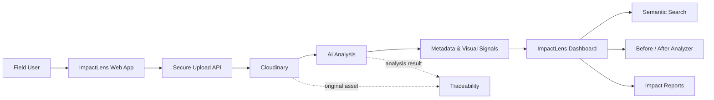

# 🌱 ImpactLens AI

> **AI-Powered Impact & Sustainability Media Intelligence Platform**

[](https://nextjs.org/)
[](https://www.typescriptlang.org/)
[](https://cloudinary.com/)
[](https://vercel.com/)
[](#license)

ImpactLens AI transforms large collections of field photos and videos into **searchable, traceable, AI-analyzed evidence** for NGOs, governments, sustainability teams, and impact-driven organizations.

Built for **Code Cubicle 6.0 — Cloudinary Problem Statement 02**.

---

## ✨ Why ImpactLens?

Field teams continuously capture photos and videos, but raw media is difficult to organize, search, compare, and convert into meaningful impact evidence.

**ImpactLens AI creates a complete workflow:**

```
Field Media
    ↓
Cloudinary Upload
    ↓
AI Media Analysis
    ↓
Metadata & Visual Signals
    ↓
Projects / Locations / Timeline
    ↓
Semantic Discovery
    ↓
Before ↔ After Comparison
    ↓
Impact Reports & Stories
```

---

## 🚀 Core Features

### 📤 Intelligent Media Ingestion
Upload project photos and videos through a Cloudinary-backed pipeline with secure server-generated signatures.

### 🤖 AI-Powered Media Analysis
Analyze uploaded assets using Cloudinary's analysis capabilities to extract useful visual information and generate AI-assisted metadata.

### 🏷️ Smart Metadata & Organization
Organize evidence around:

- Projects
- Activities
- Locations
- Timelines
- Visual signals
- AI-generated metadata

### 🔎 AI-Powered Search
Search the media library using natural-language concepts instead of relying only on filenames or folders.

Example:

> **"Show environmental restoration activities near the river."**

### 🆚 Before / After Impact Analyzer
Compare project evidence across time and surface measurable visual changes.

This is one of the platform's key impact-evidence workflows.

### 📊 Impact Reports
Turn analyzed media into presentation-ready impact summaries containing:

- Key observations
- Visual evidence
- Project metrics
- Before/after comparisons
- Source traceability

### 🔗 Traceable Evidence
Maintain a connection between generated insights and the original media assets, supporting transparent evidence workflows.

### 📈 Impact Dashboard
A centralized dashboard provides visibility into:

- Assets analyzed
- Active projects
- AI insights
- Evidence traceability
- Recent activity

---

## 🧠 Architecture



---

## 🛠️ Tech Stack

| Layer | Technology |
|---|---|
| Frontend | Next.js 15 |
| Language | TypeScript |
| UI | React + Custom CSS |
| Media Platform | Cloudinary |
| AI Analysis | Cloudinary Analyze API |
| API | Next.js Route Handlers |
| Deployment | Vercel |
| Source Control | GitHub |

---

## 📁 Project Structure

```
impactlens-ai/
│
├── app/
│   ├── api/
│   │   ├── analyze/
│   │   │   └── route.ts
│   │   ├── cloudinary/
│   │   │   └── sign/
│   │   │       └── route.ts
│   │   └── search/
│   │       └── route.ts
│   │
│   ├── dashboard/
│   ├── media/
│   ├── projects/
│   ├── upload/
│   ├── search/
│   ├── before-after/
│   ├── reports/
│   ├── activity/
│   ├── page.tsx
│   ├── layout.tsx
│   └── globals.css
│
├── components/
│   └── uploader.tsx
│
├── lib/
│   └── demo-data.ts
│
├── .env.example
├── next.config.ts
├── package.json
└── tsconfig.json
```

---

## 🔐 Cloudinary Integration

ImpactLens uses a **server-generated signed upload flow**.

### Upload flow

```text
Browser
  │
  │ 1. Request signature
  ▼
Next.js /api/cloudinary/sign
  │
  │ 2. Generate secure signature
  ▼
Browser
  │
  │ 3. Signed upload
  ▼
Cloudinary
  │
  │ 4. Asset URL + asset ID
  ▼
Next.js /api/analyze
  │
  │ 5. AI analysis
  ▼
ImpactLens
```

The Cloudinary API secret remains server-side and is never exposed to the browser.

---

## ⚙️ Getting Started

### 1. Clone

```bash
git clone https://github.com/Mohitrath/impactlens-ai.git
cd impactlens-ai
```

### 2. Install dependencies

```bash
npm install
```

### 3. Configure environment variables

Create `.env.local`:

```env
NEXT_PUBLIC_CLOUDINARY_CLOUD_NAME=your_cloud_name
CLOUDINARY_API_KEY=your_api_key
CLOUDINARY_API_SECRET=your_api_secret
CLOUDINARY_ANALYSIS_MODEL=captioning
```

### 4. Start development server

```bash
npm run dev
```

Open:

```
http://localhost:3000
```

### 5. Production build

```bash
npm run build
npm start
```

---

## ☁️ Deploy to Vercel

1. Import the GitHub repository into Vercel.
2. Select **Next.js** as the framework.
3. Add the Cloudinary environment variables.
4. Deploy.
5. Test the **Upload → Analyze** workflow.

### Required Vercel variables

| Variable | Required |
|---|:---:|
| `NEXT_PUBLIC_CLOUDINARY_CLOUD_NAME` | ✅ |
| `CLOUDINARY_API_KEY` | ✅ |
| `CLOUDINARY_API_SECRET` | ✅ |
| `CLOUDINARY_ANALYSIS_MODEL` | ✅ |

> **Security:** Never commit `.env.local`, API keys, or API secrets to GitHub.

---

## 🎯 Code Cubicle 6.0 Alignment

### Problem

Organizations working on sustainability, infrastructure, community development, and environmental projects generate huge volumes of visual evidence that can be difficult to organize and interpret.

### Our Solution

ImpactLens AI provides a unified media intelligence workflow for:

- Large image/video collections
- Project and activity identification
- Location and timeline organization
- AI-powered metadata
- Semantic media discovery
- Before/after comparison
- Visual impact reporting
- Evidence traceability

### Expected Outcome

```
Raw Field Media
      ↓
Structured Evidence
      ↓
Searchable Intelligence
      ↓
Visual Impact Analysis
      ↓
Compelling Impact Stories
```

---

## 🧪 Demo Workflow

A recommended hackathon demonstration:

### 01 — Dashboard
Show the centralized impact overview.

### 02 — Upload
Upload a field image/video.

### 03 — Cloudinary
Show the asset being stored and processed.

### 04 — AI Analysis
Display generated analysis and metadata.

### 05 — Search
Search for a visual concept or project activity.

### 06 — Before / After
Compare two project stages.

### 07 — Impact Report
Generate a concise evidence-backed project summary.

### 08 — Traceability
Show how the insight connects back to the original asset.

---

## 🌍 Example Use Cases

### 🌳 Environmental Restoration
Track vegetation, cleanup activities, restoration progress, and site changes.

### 🏗️ Infrastructure Programs
Document construction progress and compare project stages.

### 💧 Water & Sanitation
Organize evidence from water access, sanitation, and community infrastructure projects.

### 🏘️ Community Development
Turn field documentation into searchable project evidence.

### 🏛️ Government Programs
Create structured visual evidence for public-sector initiatives.

### 🤝 NGO Impact Reporting
Convert thousands of field assets into campaign-ready impact stories.

---

## 🔮 Future Roadmap

- [ ] PostgreSQL + Prisma persistence
- [ ] Multi-tenant organizations
- [ ] Role-based access control
- [ ] Advanced semantic vector search
- [ ] Automatic project clustering
- [ ] Geospatial media maps
- [ ] Timeline reconstruction
- [ ] Automated video summarization
- [ ] PDF impact-report generation
- [ ] Campaign/social-media content generation
- [ ] Batch media processing
- [ ] Advanced analytics and impact KPIs

---

## 🏆 Hackathon Value Proposition

**ImpactLens AI is not just a media library.**

It turns:

> **Media → Evidence → Intelligence → Impact Story**

The platform combines Cloudinary's media infrastructure with AI-assisted analysis and a purpose-built impact intelligence interface to make field evidence easier to organize, discover, compare, and communicate.

---

## 🔗 Links

- **GitHub:** https://github.com/Mohitrath/impactlens-ai
- **Cloudinary:** https://cloudinary.com/
- **Vercel:** https://vercel.com/

---

## 👥 Team

Built for **Code Cubicle 6.0**.

> Turning field evidence into measurable impact with AI + Cloudinary.

---

## 📄 License

This project is provided for hackathon and educational purposes.

---

<div align="center">

### 🌱 ImpactLens AI

**AI-powered media intelligence for real-world impact**

⭐ Star the repository if you like the project!

</div>
